# Geppetto: Multi-Robot Exploration System

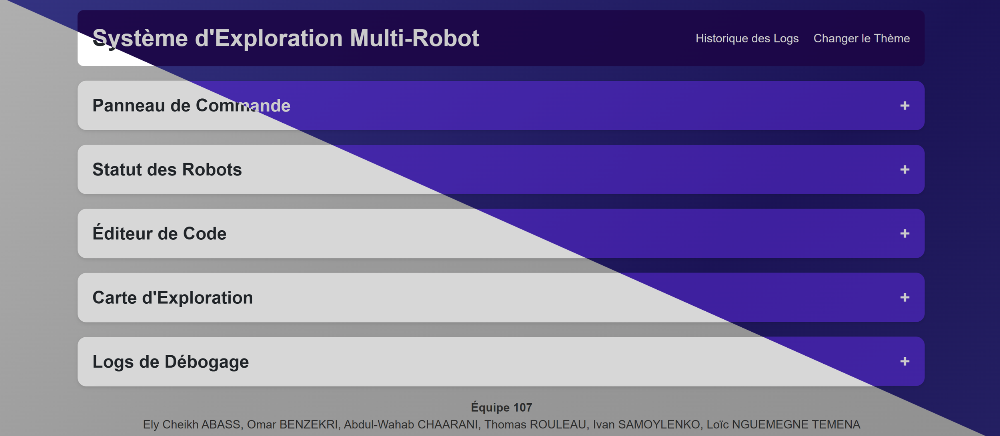

## Table of Contents
- [Geppetto: Multi-Robot Exploration System](#geppetto-multi-robot-exploration-system)
  - [Table of Contents](#table-of-contents)
  - [Project Overview](#project-overview)
  - [Technologies and Architecture](#technologies-and-architecture)
  - [Setup and Launch](#setup-and-launch)
    - [Prerequisites](#prerequisites)
    - [Setup Instructions](#setup-instructions)
  - [Usage](#usage)
  - [Robots: Agilex LIMO](#robots-agilex-limo)
    - [Key Features:](#key-features)
    - [Role in geppetto:](#role-in-geppetto)
  - [User Interface](#user-interface)
    - [Command Board](#command-board)
    - [Robot Status](#robot-status)
    - [Code Editor](#code-editor)
    - [Exploration Map](#exploration-map)
    - [Debugging Logs](#debugging-logs)
    - [Log History](#log-history)
    - [Light and Dark Modes](#light-and-dark-modes)
  - [Embedded System](#embedded-system)
    - [Software Architecture](#software-architecture)
    - [Key Features and Dependencies](#key-features-and-dependencies)
  - [Simulation (Gazebo)](#simulation-gazebo)
    - [Motivation and Justification](#motivation-and-justification)
    - [Simulation Architecture](#simulation-architecture)
    - [Challenges and Improvements](#challenges-and-improvements)
  - [Contributors](#contributors)
  - [License](#license)

---

## Project Overview
**Geppetto** is a proof-of-concept project demonstrating a multi-robot exploration system capable of autonomously navigating and mapping unknown environments. Designed for research and educational purposes in space exploration, this system complies with the minimum sensor requirements of the Canadian Space Agency (CSA). The system enables real-time monitoring, control, and debugging through an interactive web interface.

Key features include:
- Real-time mapping of the exploration zone.
- Autonomous collaboration between robots via peer-to-peer (P2P) communication.
- Advanced command and control functionalities for mission execution.
- Persistent storage of exploration data using MongoDB for analysis and debugging.

---

## Technologies and Architecture
The project integrates several advanced technologies:
- **ROS (Robot Operating System)**: Manages robot control, communication, and sensor data processing.
- **Embedded Python Code**: Executes controller logic and robot-specific functions.
- **WebSockets**: Facilitates real-time bidirectional communication between the robots, server, and client.
- **Frontend**: Angular-based web interface for user interaction and real-time monitoring.
- **Backend**: NestJS API serving as the middleware between ROS nodes, MongoDB, and the client.
- **MongoDB**: Persistent storage for mission data, logs, and exploration maps.
- **Docker**: Simplifies deployment with containerized services for the frontend, backend, and simulation.

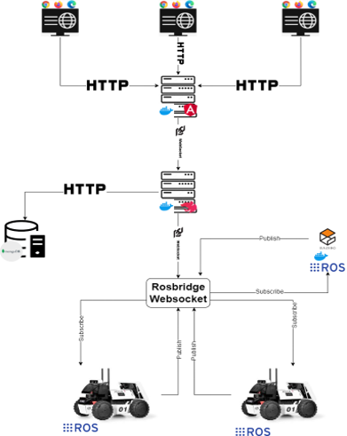

---

## Setup and Launch

### Prerequisites
- Docker installed on your system.
- MongoDB installed and configured.

### Setup Instructions
1. **Clone the Repository**:
   ```bash
   git clone https://github.com/thomas-rou/Geppetto
   cd Geppetto
   ```

2. **Start Services**:
   Run the following script to start the system:
   ```bash
   ./start.sh
   ```

3. **Access the Interface**:
   - Server: [http://localhost:3000](http://localhost:3000)
   - Client: [http://localhost:4200](http://localhost:4200)

---

## Usage
1. **Launch the System**: Start the backend, client, and simulation environment using Docker.
2. **Initiate a Mission**: Use the command board to start, control, and end missions.
3. **Analyze Data**: Review real-time data on the exploration map and robot status components.
4. **Inspect Logs**: Access mission logs and metadata via the debugging logs and log history pages.

---

## Robots: Agilex LIMO

The **Agilex LIMO robots** serve as the core of the Geppetto system, delivering a versatile and reliable platform for autonomous exploration. These robots are lightweight, agile, and equipped with advanced features tailored for both indoor and outdoor operations.

<div style="display: flex; justify-content: space-between;">
   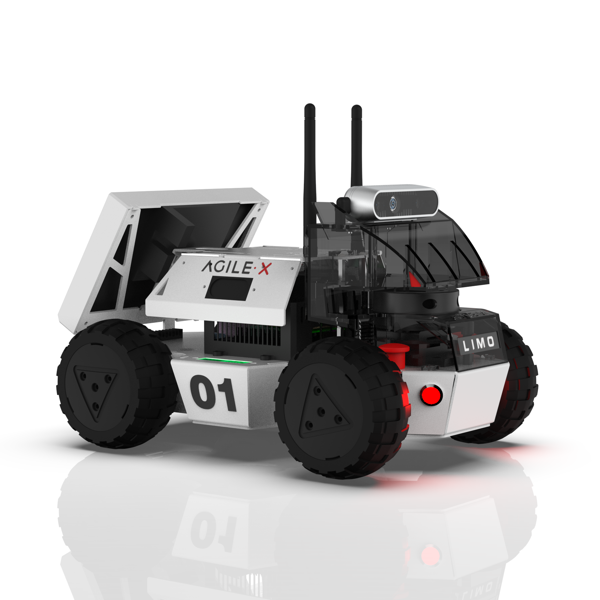
   
</div>

### Key Features:
- **Modular Design**: The LIMO platform supports multiple configurations (Ackermann, tracked, omnidirectional, and differential) to adapt to diverse terrains and exploration needs.
- **SLAM Integration**: Equipped with sensors and computational power for simultaneous localization and mapping (SLAM), enabling real-time environment mapping and navigation.
- **Built-in Sensors**: Includes LiDAR, cameras, and IMUs, ensuring comprehensive perception and obstacle avoidance capabilities.
- **Customizable**: Fully programmable via ROS2, allowing seamless integration with the exploration algorithms and custom mission requirements.

### Role in geppetto:
- **Autonomous Navigation**: The LIMO robots navigate and map unknown environments autonomously using the integrated ROS2 navigation stack.
- **P2P Communication**: Robots communicate and collaborate in real time to optimize exploration and share mapping data.
- **Real-World Testing**: The robust design and reliable sensors make the LIMO ideal for both simulated and physical testing environments.

The use of Agilex LIMO robots ensured a balance of flexibility, performance, and ease of programming, making them an indispensable part of the Geppetto system.

---

## User Interface

### Command Board
The command board is the control hub for mission management. It includes:
- **Start Mission**: Initiates the exploration process.
- **End Mission**: Halts the exploration.
- **Return Home**: Commands the robots to return to their starting positions.
- **P2P Communication**: Enables robots to share data and determine which is furthest from the ground station, displaying results on their respective screens.
- **Set Geofence**: Defines the boundary within which robots must operate.
- **Update Controller Code**: Allows real-time updates to the robots' Python-based control logic.


---

### Robot Status
This component provides real-time status updates, including:
- **Battery Level**: Displays the battery status of both robots.
- **Robot Status**: Reports operational status and alerts.
- **Identify Command**: Allows users to visually identify a specific robot in the field.

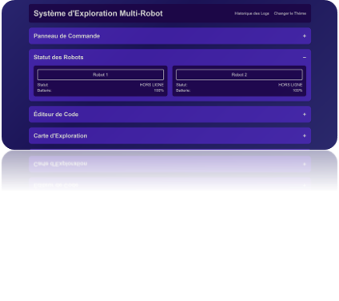

---

### Code Editor
The code editor enables dynamic updates to the controller code, which can be applied to either the simulation or physical robots in real-time. This feature is essential for testing and deploying new exploration algorithms.

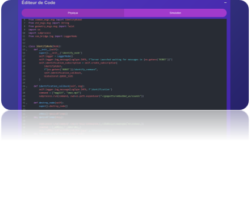

---

### Exploration Map
The exploration map visualizes the environment in real-time, including:
- **Generated Map**: Displays the layout of the explored area.
- **Robot Positions**: Updates robot positions live as they navigate the environment.

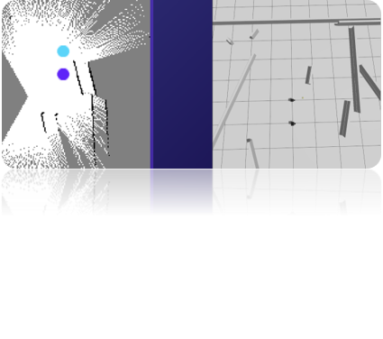

---

### Debugging Logs
This component logs every event and action during a mission, including:
- Mission start and end times.
- Command execution (e.g., Start Mission, Set Geofence).
- Robot communication and status updates.
Logs are automatically cleared at the start of a new mission.

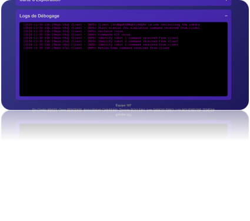

---

### Log History
The **Historique des Logs** page provides a detailed record of past missions, allowing for:
- **Filtering and Sorting**: Search logs by attributes like mission duration, errors, or map size.
- **Data Inspection**: View logs, maps, and mission metadata stored in MongoDB.

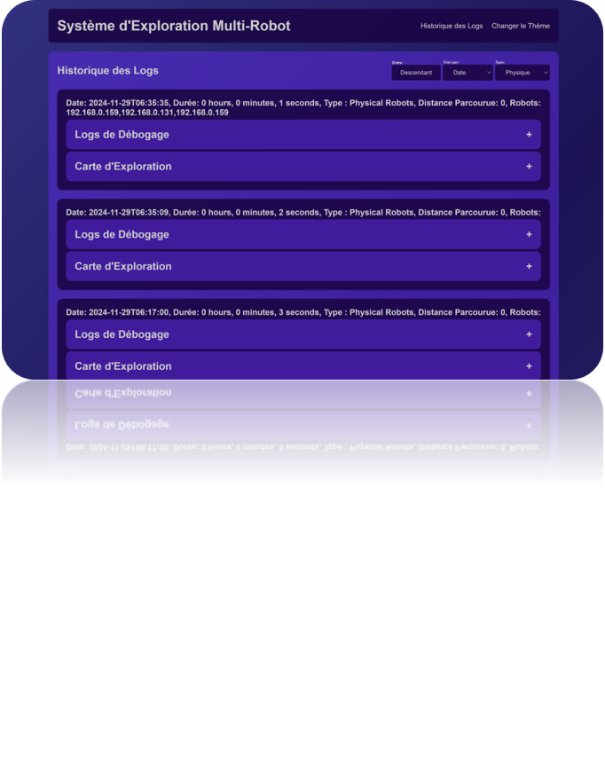

---

### Light and Dark Modes
The web interface supports both light and dark themes for enhanced user experience and accessibility.

---

## Embedded System

### Software Architecture
The embedded system is designed with modularity in mind, leveraging dedicated ROS nodes for specific tasks such as mission management and autonomous exploration.

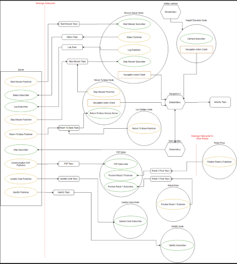

### Key Features and Dependencies
- **Mapping and Navigation**:
  - **SLAM Toolbox**: Real-time mapping of the environment.
  - **Nav2**: Enables autonomous exploration and obstacle avoidance.
- **Sensors**:
  - **orbbec_camera**: Facilitates safety features like fall detection.
- **Communication**:
  - **Rosbridge WebSocket**: Supports JSON-based communication with the server.
  - **P2P Node**: Allows robots to share data directly for enhanced collaboration.
- **Persistence**:
  - Stores mission history, including date, duration, and maps in MongoDB.

---

## Simulation (Gazebo)

### Motivation and Justification
Simulation is a critical aspect of the project, allowing robust testing without the constraints of physical hardware. Key reasons include:
- High cost and limited availability of robots.
- Avoiding hardware wear and tear.
- Minimizing variability in test conditions.
- Enabling remote development and collaboration.

### Simulation Architecture
- **Integration**: Seamless interaction with ROS2 for realistic sensor and physics simulation.
- **Algorithms**: Identical to those used on physical robots, ensuring consistency in testing and deployment.

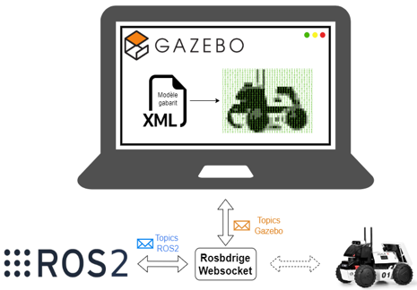

### Challenges and Improvements
- **Message Interleaving**: Overlapping robot communications caused synchronization issues.
- **File Duplication**: Replication of simulation data across robots led to inefficiencies.
- **Generated Environments**: Simulations include randomly generated environments to mimic real-world unpredictability.
- **Safety Zones**: Implementing geofences to ensure robots operate within defined boundaries.

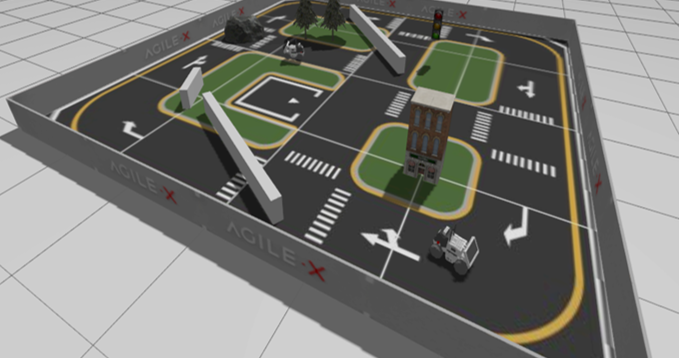

---

## Contributors
- **Ely Cheikh Abyss**
- **Omar Benzekri**
- **Abdul-Wahab Chaarani**
- **Loïc Nguemegne**
- **Thomas Rouleau**
- **Ivan Samoylenko**

---

## License
This project is licensed under the MIT License. See the [LICENSE](LICENSE) file for details.